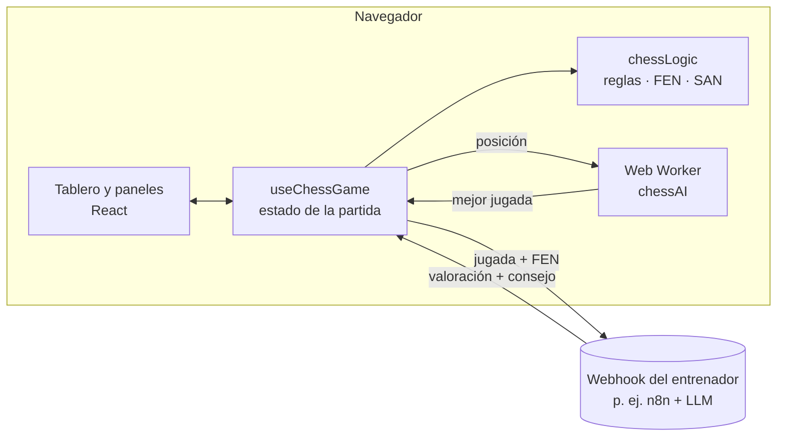

<div align="center">

# Aprende Ajedrez

[English](README.md) · **Español**

**Juega al ajedrez contra una IA integrada y recibe comentarios de un entrenador después de cada jugada.**
Reglas completas, cinco niveles de dificultad y un motor que funciona en un Web Worker, todo en el navegador.


</div>

---

## Descripción general

Aprende Ajedrez es un entrenador de ajedrez para principiantes y jugadores ocasionales. Juegas una partida completa contra una IA con la fuerza que elijas y, después de cada jugada tuya, un entrenador la valora y te sugiere en qué pensar a continuación.

El motor de ajedrez y la IA están escritos desde cero en TypeScript, sin librerías de ajedrez. El entrenador es un webhook externo (por ejemplo, un flujo de n8n con un modelo de lenguaje), así que puedes conectar el análisis que prefieras.

## Funcionalidades

### Partida
- **Reglas completas**: enroque, captura al paso, coronación con selector de pieza, jaque, jaque mate y tablas por ahogado, material insuficiente y regla de los 50 movimientos.
- **Juega con blancas o negras**, con el tablero girado hacia tu lado.
- **Haz clic o arrastra** las piezas; se resaltan los destinos legales, la última jugada y el rey en jaque.
- **Lista de movimientos en notación algebraica** (`Nf3`, `exd6`, `O-O`, `e8=Q+`).
- Sonidos de movimiento, captura y jaque generados con la Web Audio API.

### Rival IA
- **Cinco niveles**, de *Principiante* a *Experto*.
- Búsqueda negamax con poda alfa-beta, capturas ordenadas primero y búsqueda de quietud.
- Profundización iterativa con un tiempo máximo por nivel (de 0,3 s a 3 s).
- Tablas de posición para todas las piezas, con una tabla distinta para el rey en el final.
- Los niveles bajos eligen al azar entre jugadas casi óptimas para cometer errores más humanos.
- Funciona en un **Web Worker**, así que la página no se congela mientras piensa.

### Entrenador
- Después de cada jugada tuya, la app envía a un webhook la jugada en SAN y las posiciones anterior y posterior en FEN.
- El panel muestra la valoración (*excelente*, *buena*, *imprecisa*, *error*, *grave*), una explicación y la siguiente idea a trabajar.

## Arquitectura



| Capa | Tecnología |
|---|---|
| Interfaz | React 18, TypeScript, Tailwind CSS, shadcn/ui, lucide-react |
| Build | Vite 5 |
| Motor | Generador de jugadas propio, FEN/SAN e IA negamax |
| Tests | Vitest (perft y tests tácticos) |

## Puesta en marcha

### Requisitos
- Node.js 18 o superior

### Ejecutar

```bash
git clone https://github.com/David-Raffo/aprende-ajedrez.git
cd aprende-ajedrez
npm install
npm run dev
```

Abre <http://localhost:8080>. El juego funciona sin configuración; solo el entrenador necesita un webhook.

### Webhook del entrenador

Copia `.env.example` a `.env` y define la URL:

```bash
VITE_COACH_WEBHOOK_URL=https://tu-servidor/webhook/ajedrez
```

La app envía una petición `POST` con un JSON como este:

```json
{
  "from": "g1",
  "to": "f3",
  "san": "Nf3",
  "piece": "knight",
  "pieceColor": "white",
  "move": "blancas Nf3",
  "captured": false,
  "capturedPiece": null,
  "promotion": null,
  "playerColor": "white",
  "turn": "black",
  "fenBefore": "rnbqkbnr/pppp1ppp/8/4p3/4P3/8/PPPP1PPP/RNBQKBNR w KQkq e6 0 2",
  "fenAfter": "rnbqkbnr/pppp1ppp/8/4p3/4P3/5N2/PPPP1PPP/RNBQKB1R b KQkq - 1 2",
  "timestamp": "2026-06-21T10:00:00.000Z"
}
```

y espera una respuesta así:

```json
{
  "isGoodMove": true,
  "rating": "buena",
  "explanation": "El caballo controla el centro y prepara el enroque.",
  "improvement": "Sigue desarrollando con Bc4 o Bb5."
}
```

`rating` debe ser `excelente`, `buena`, `imprecisa`, `error` o `grave`. La URL queda incluida en el código del cliente, así que protege el webhook (límite de peticiones, orígenes permitidos) si publicas la app.

### Scripts

| Comando | Descripción |
|---|---|
| `npm run dev` | Servidor de desarrollo en el puerto 8080 |
| `npm run build` | Comprobación de tipos y build de producción en `dist/` |
| `npm run preview` | Sirve el build de producción |
| `npm test` | Ejecuta los tests con Vitest |
| `npm run lint` | ESLint |

## Tests

El generador de jugadas se comprueba con **perft** contra las posiciones de referencia habituales (posición inicial, "Kiwipete" y otras): cuenta todas las secuencias de jugadas legales hasta cierta profundidad y detecta errores en enroques, capturas al paso, clavadas y coronaciones. La IA tiene tests tácticos, como encontrar un mate en una o no capturar con la dama un peón defendido.

```bash
npm test
```

## Estructura del proyecto

```
aprende-ajedrez/
├── src/
│   ├── components/
│   │   ├── ChessBoard.tsx       # Tablero, resaltados, clic y arrastre
│   │   ├── PromotionDialog.tsx
│   │   ├── CoachPanel.tsx
│   │   ├── MoveHistory.tsx
│   │   ├── GameControls.tsx
│   │   └── GameStatus.tsx
│   ├── hooks/useChessGame.ts    # Estado, turnos de la IA y entrenador
│   ├── utils/
│   │   ├── chessLogic.ts        # Reglas, FEN, SAN y perft
│   │   ├── chessAI.ts           # Evaluación y búsqueda
│   │   ├── chessAI.worker.ts
│   │   ├── aiClient.ts          # Envoltorio del worker con cancelación
│   │   └── __tests__/
│   ├── pages/Index.tsx
│   └── types/chess.ts
└── docs/img/
```

## Licencia

Publicado bajo la [licencia MIT](LICENSE).

<div align="center"><sub>Hecho por <a href="https://github.com/David-Raffo">David Raffo</a></sub></div>
