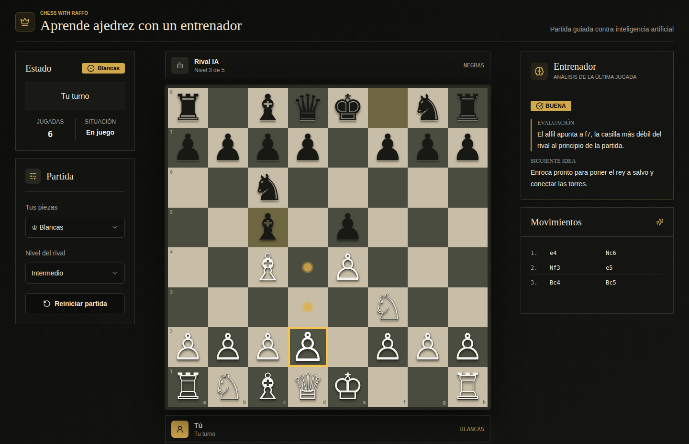
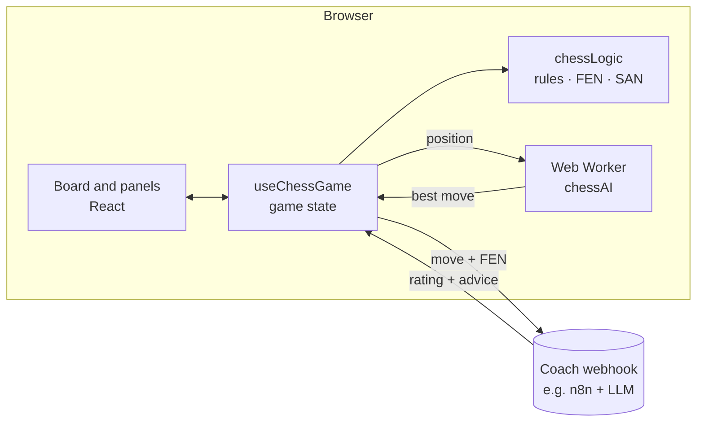

<div align="center">

# Aprende Ajedrez

**English** · [Español](README.es.md)

**Play chess against a built-in AI and get feedback on every move from a coach.**
Full chess rules, five difficulty levels and an engine that runs in a Web Worker, all in the browser.

### [▶ Live demo](https://chesswithraffo.lovable.app/)




</div>

---

## Overview

Aprende Ajedrez ("learn chess") is a chess trainer for beginners and casual players. You play a full game against an AI opponent whose strength you choose, and after each of your moves a coach rates it and suggests what to think about next.

The chess engine and the AI are written from scratch in TypeScript with no chess libraries. The coach is an external webhook (for example an n8n workflow with a language model), so you can plug in the analysis you prefer.

> The user interface is in Spanish. A Spanish version of this document is available in [README.es.md](README.es.md).

## Features

### Playing
- **Complete rules**: castling, en passant, promotion with a piece picker, check, checkmate and draws by stalemate, insufficient material and the fifty-move rule.
- **Play as white or black**, with the board flipped to your side.
- **Click or drag** pieces; legal destinations, the last move and a king in check are highlighted.
- **Move list in standard algebraic notation** (`Nf3`, `exd6`, `O-O`, `e8=Q+`).
- Move, capture and check sounds generated with the Web Audio API.

### AI opponent
- **Five levels**, from *Beginner* to *Expert*.
- Negamax search with alpha-beta pruning, capture-first move ordering and quiescence search.
- Iterative deepening with a time budget per level (0.3 s to 3 s).
- Piece-square tables for every piece, with a separate king table for the endgame.
- Lower levels pick randomly among near-best moves so they make human-like mistakes.
- Runs in a **Web Worker**, so the page stays responsive while it thinks.

### Coach
- After each of your moves, the app sends the move in SAN and the positions before and after it in FEN to a webhook.
- The panel shows the rating (*excelente*, *buena*, *imprecisa*, *error*, *grave*), an explanation and the next idea to work on.

## Architecture



| Layer | Technology |
|---|---|
| UI | React 18, TypeScript, Tailwind CSS, shadcn/ui, lucide-react |
| Build | Vite 5 |
| Engine | Custom move generator, FEN/SAN and negamax AI |
| Tests | Vitest (perft and tactical tests) |

## Getting started

### Requirements
- Node.js 18 or newer

### Run

```bash
git clone https://github.com/David-Raffo/aprende-ajedrez.git
cd aprende-ajedrez
npm install
npm run dev
```

Open <http://localhost:8080>. The game works without any configuration; only the coach needs a webhook.

### Coach webhook

Copy `.env.example` to `.env` and set the URL:

```bash
VITE_COACH_WEBHOOK_URL=https://your-server/webhook/chess
```

The app sends a `POST` request with a JSON body like this:

```json
{
  "from": "g1",
  "to": "f3",
  "san": "Nf3",
  "piece": "knight",
  "pieceColor": "white",
  "move": "blancas Nf3",
  "captured": false,
  "capturedPiece": null,
  "promotion": null,
  "playerColor": "white",
  "turn": "black",
  "fenBefore": "rnbqkbnr/pppp1ppp/8/4p3/4P3/8/PPPP1PPP/RNBQKBNR w KQkq e6 0 2",
  "fenAfter": "rnbqkbnr/pppp1ppp/8/4p3/4P3/5N2/PPPP1PPP/RNBQKB1R b KQkq - 1 2",
  "timestamp": "2026-06-21T10:00:00.000Z"
}
```

and expects a response like:

```json
{
  "isGoodMove": true,
  "rating": "buena",
  "explanation": "The knight controls the centre and prepares castling.",
  "improvement": "Continue developing with Bc4 or Bb5."
}
```

`rating` must be one of `excelente`, `buena`, `imprecisa`, `error` or `grave`. The URL is embedded in the client bundle, so protect the webhook (rate limiting, allowed origins) if you publish the app.

### Scripts

| Command | Description |
|---|---|
| `npm run dev` | Development server on port 8080 |
| `npm run build` | Type check and production build into `dist/` |
| `npm run preview` | Serve the production build |
| `npm test` | Run the Vitest suite |
| `npm run lint` | ESLint |

## Testing

The move generator is checked with **perft** against the standard reference positions (initial position, "Kiwipete" and others), which counts every legal move sequence up to a given depth and catches mistakes in castling, en passant, pins and promotions. The AI has tactical tests such as finding a mate in one and not taking a defended pawn with the queen.

```bash
npm test
```

## Project structure

```
aprende-ajedrez/
├── src/
│   ├── components/
│   │   ├── ChessBoard.tsx       # Board, highlights, click and drag input
│   │   ├── PromotionDialog.tsx
│   │   ├── CoachPanel.tsx
│   │   ├── MoveHistory.tsx
│   │   ├── GameControls.tsx
│   │   └── GameStatus.tsx
│   ├── hooks/useChessGame.ts    # Game state, AI turns and coach requests
│   ├── utils/
│   │   ├── chessLogic.ts        # Rules, FEN, SAN and perft
│   │   ├── chessAI.ts           # Evaluation and search
│   │   ├── chessAI.worker.ts
│   │   ├── aiClient.ts          # Worker wrapper with cancellation
│   │   └── __tests__/
│   ├── pages/Index.tsx
│   └── types/chess.ts
└── docs/img/
```

## License

Released under the [MIT License](LICENSE).

<div align="center"><sub>Built by <a href="https://github.com/David-Raffo">David Raffo</a></sub></div>
